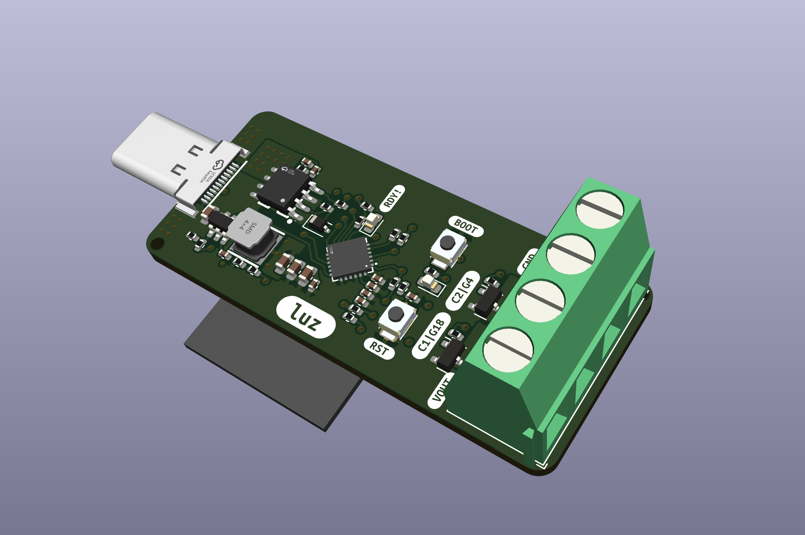

# luz
An experiment in USB-C power delivery.



This repo contains printed circuit board fabrication files and firmware sample for a basic USB-C power delivery "trigger board" with an accompanying ESP32.

## Hardware
The CYPD3177 IC is used to negotiate power contracts with USB-C power supplies, and communicates with the onboard ESP32 via I2C for control and monitoring.

Once the required power delivery contract is successfully negotiated, the ESP32 may control two MOSFET channels to switch power to two different loads. The original use case is to deliver 12 V @ 3 A to LED strips, but any load up to 3A and 20V may be used in principle.

### Main Components
- [CYPD3177](https://www.infineon.com/cms/en/product/universal-serial-bus/usb-c-charging-port-controllers/ez-pd-barrel-connector-replacement-bcr/cypd3177-24lqxq/) USB-C PD controller
- ESP32-WROOM-32
  - For this prototype I used this older module since I still have a bunch of them around.

## Software
The CYPD3177 is configured during runtime via I2C. I implemented the `cypd3177` component in an [ESPHome](https://esphome.io/) fork (at [rbaron/esphome/cypd3177](https://github.com/rbaron/esphome/tree/cypd3177)).

In this repo there are sample `yaml` files under [./code/esphome](./code/esphome) that uses the `cypd3177` as an external component.

To configure a power delivery contract, set up the `cypd3177` component in ESPHome as for example:
```yaml
cypd3177:
  interrupt_pin: GPIO23
  voltage: 9000 mV
  current: 1000 mA
```

## USB-C Power Delivery Support & Maximum Power
The CYPD3177 supports USB-C PD 3.0, but unfortunately does not support Programmable Power Supply (PPS) contracts. The board is a prototype, mostly for learning, designed to handle a maximum of only 3 A.

USB-C PD 3.0 mandates support for a few standard fixed power profiles, namely providing 5 V, 9 V, 15 V and 20 V. Some USB-C PD sources may also support 12 V. Enabling logging for the `cypd3177` component in ESPHome will show the power profiles supported by the source. For example:

```
16:08:41.416 -> [I][cypd3177.pdo:059]: Fixed PDO: 5000 mV, 3000 mA
16:08:41.416 -> [I][cypd3177.pdo:059]: Fixed PDO: 9000 mV, 3000 mA
16:08:41.416 -> [I][cypd3177.pdo:059]: Fixed PDO: 12000 mV, 2000 mA
16:08:41.416 -> [I][cypd3177.pdo:059]: Fixed PDO: 15000 mV, 2000 mA
16:08:41.416 -> [I][cypd3177.pdo:059]: Fixed PDO: 20000 mV, 1500 mA
16:08:41.416 -> [I][cypd3177.pdo:066]: Augmented SPR_PPS PDO: 3300 - 11000 mV, 3000 mA
```